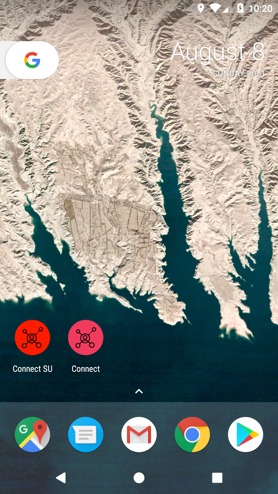
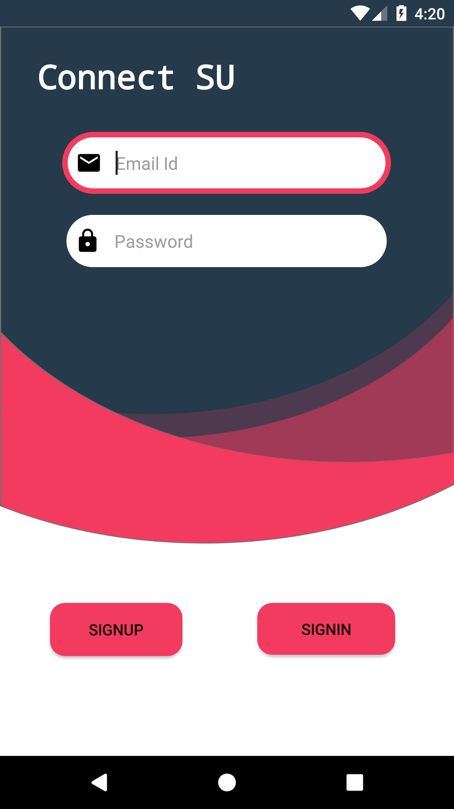
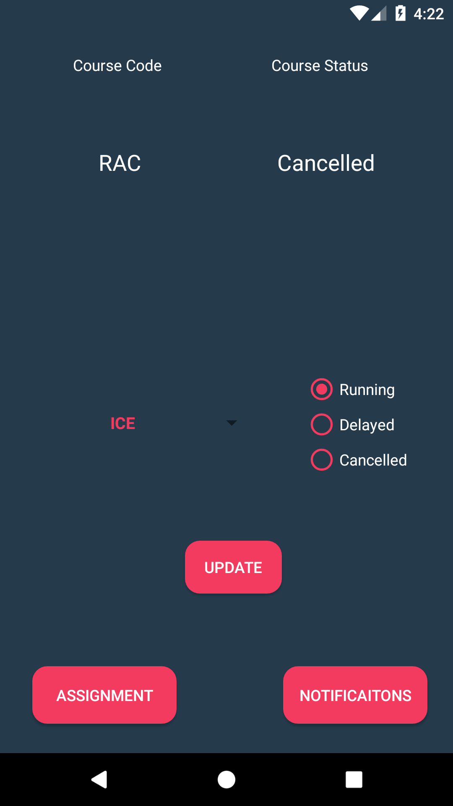
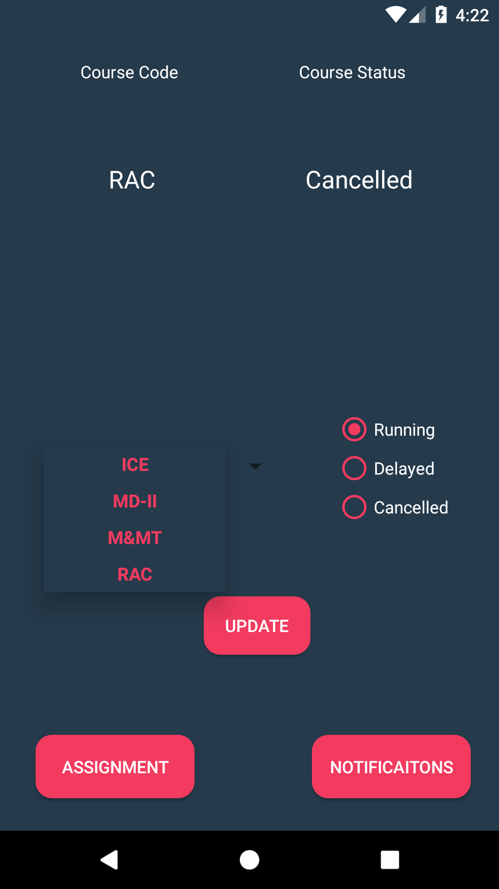
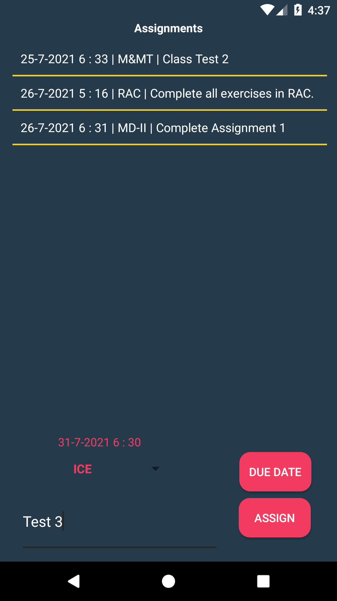
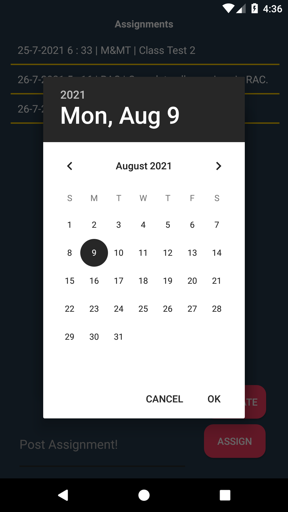
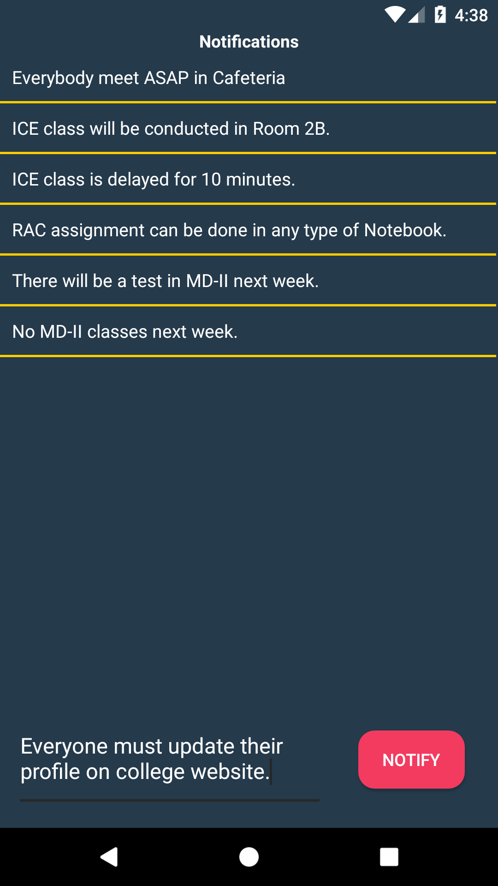

# Connect SU
“Connect-Su” Centralized Notification and Task Assignment App for teachers and class representatives for broadcasting notifications, tasks, and lecture status to students.

## Requirements :
- Android
## Use :
    1. You have to contact the administrator to get yourself registered as a superuser.
    2. You can now signup using your college email id and verify your email id.
    2. You can now broadcast notifications, assignments, and status of your lectures (i.e. whether they are delayed, canceled, or running) to students.

## Features :
<h4>App Icon</h4>

<h4>LogIn/SignUp</h4>

<h4>Update Lecture Status with Subject</h4>

<h4>Assign Assignments with Due Date</h4>

<h4>Notify Notifications</h4>

